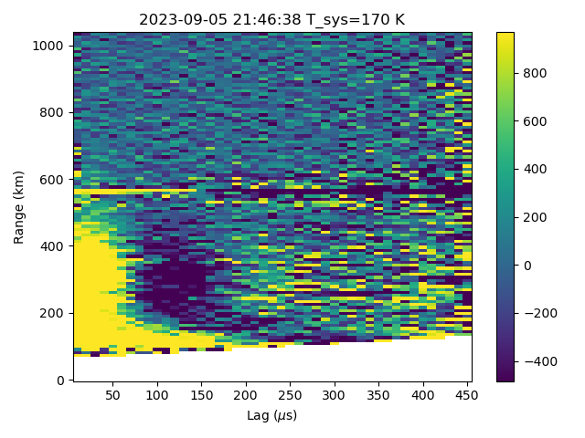

# ISR Analysis Pipeline

Tools for collective Thomson scatter radar ionospheric plasma-parameter analysis. The pipeline handles space-object contamination, radio-frequency interference, and coded/uncoded long-pulse modes.



## Quick start

```bash
# 1. Clone the repo
git clone https://github.com/jvierine/isr_analysis.git ~/src/isr_analysis
cd ~/src/isr_analysis

# 2. Create the Python virtual environment (once per machine)
bash setup_env.sh

# 3. Edit or create a config file under config/
cp config/millstone_2023-09-05.json config/my_experiment.json
# ... edit data_dir, output_dir, radar_freq_hz, etc.

# 4. Run (replace 24 with your core count)
mpirun -np 24 ~/venv/isr_analysis/bin/python3 \
    run_analysis.py config/my_experiment.json
```

## Setup details

### Python environment

`setup_env.sh` creates `~/venv/isr_analysis` with `--system-site-packages` so
it inherits system-installed numpy/scipy/matplotlib/h5py, then pip-installs:

| Package | Purpose |
|---------|---------|
| `pyfftw` | Fast FFT via FFTW3 (needs `libfftw3-dev`) |
| `digital_rf` | Read raw DigitalRF HDF5 voltage data |
| `mpi4py` | MPI parallelisation |
| `jcoord` | Geographic coordinate conversion |

Activate the environment (optional, only needed for interactive use):
```bash
source ~/venv/isr_analysis/bin/activate
```

### ISR theory lookup tables

Plasma-parameter fitting requires a precomputed spectral interpolation table.
The table is cached in `./data/` and regenerated automatically if it does not
exist or if you change `radar_freq_hz` in the config. Generation takes
~10–30 minutes depending on the machine; subsequent runs load the cached file.

Override the cache directory with `"table_dir": "/path/to/tables"` in your
JSON config.

## Configuration

Config files live in `config/`. Key fields:

```json
{
  "experiment":    "my_experiment",
  "data_dir":      "/path/to/raw/digitalrf/experiment",
  "output_dir":    "/path/to/results",         // optional
  "max_time_s":    600,                          // omit for full dataset
  "radar_freq_hz": 440200000,                    // default 440.2 MHz
  "table_dir":     "./data",                     // optional, default ./data

  "steps": {
    "lpi":      { "enabled": true,  "channel": "zenith-l", "range_gate_us": 60, ... },
    "fit_lpi":  { "enabled": true,  "channel": "zenith-l", "max_dt": 300, ... },
    "long_pulse":{ "enabled": false, ... },
    "fit_lp":   { "enabled": false, ... }
  }
}
```

See `config/millstone_2023-09-05.json` for a complete annotated example.

## Analysis modes

### Coded long pulse (LPI)

High-range-resolution bottom-side analysis. Run in order:

1. `outlier_lpi.py` — lag-profile inversion; estimates ACFs per range gate
2. `fit_lpi.py` — fits ACFs to Te, Ti, vi, ne profiles

Driven by the `lpi` and `fit_lpi` steps in the config.

### Uncoded long pulse

Low range resolution, optimised for the topside where SNR is low. Run in order:

1. `avg_range_doppler_spec.py` — range-Doppler spectral averaging
2. `fit_lp.py` — fits Doppler spectra to Te, Ti, vi, ne

Driven by the `long_pulse` and `fit_lp` steps in the config.

## Output files

Results go to `output_dir` (or alongside the raw data if unset):

```
lpi_<rg_us>/zenith-l/
  lpi-<unix_t>.h5    ACF per range gate and lag
  lpi-<unix_t>.png   diagnostic image

lpi_<rg_us>/zenith-l/
  pp-<unix_t>.h5     Te, Ti, vi, ne profiles
  pp-<unix_t>.png    diagnostic plot
```

> Code is still under active development.
